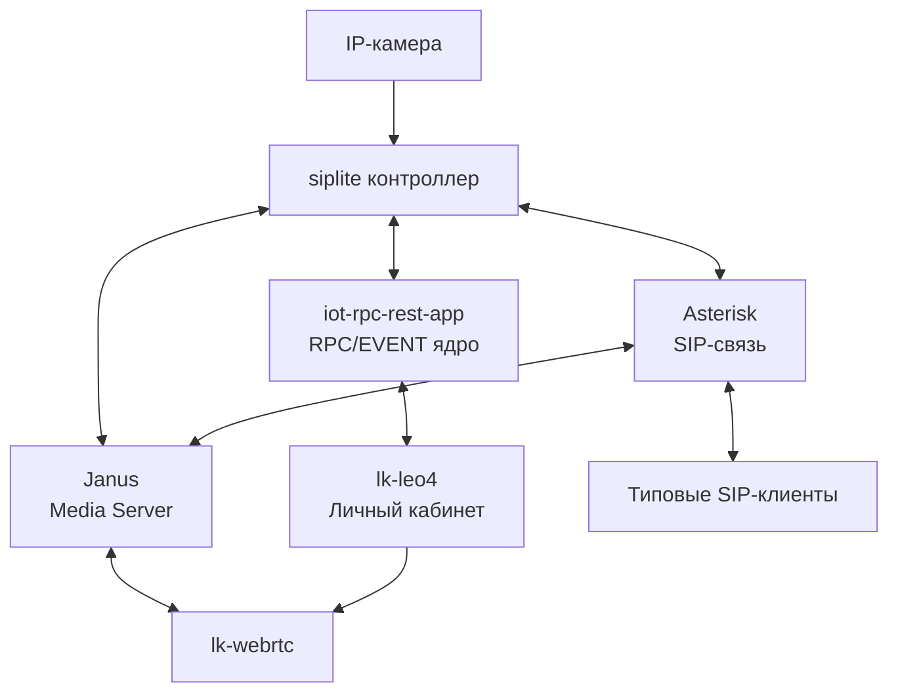
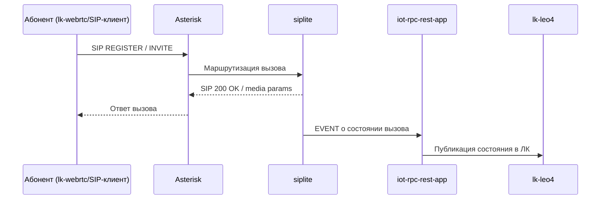
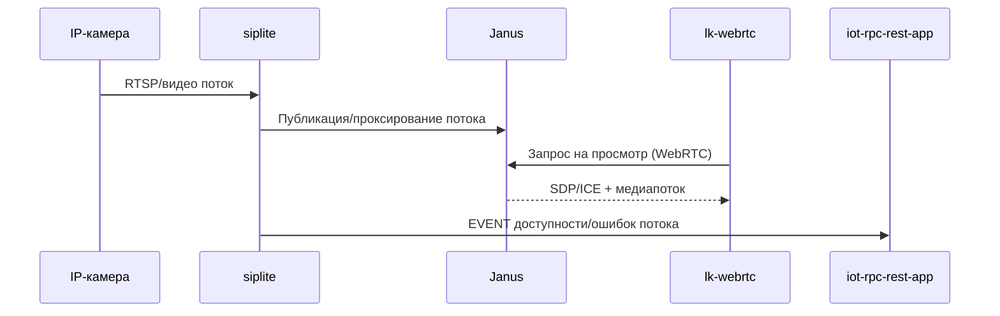
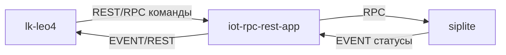

# Презентация решения: SIP/Video инфраструктура с lk-webrtc

## 1. Цель решения

Построить единую платформу голосовой и видеосвязи, где:
- контроллер **siplite** управляет SIP/видеотерминалами и подключенной IP-камерой;
- ядро **iot-rpc-rest-app** обеспечивает RPC/EVENT-взаимодействие контроллеров;
- личный кабинет **lk-leo4** предоставляет операторский и клиентский интерфейс;
- медиапотоки обрабатываются через **Janus**;
- SIP-сигнализация обслуживается **Asterisk**;
- абоненты используют типовые SIP-клиенты или **lk-webrtc**.

---

## 2. Компоненты системы

- **siplite**: контроллер на объекте, интеграция SIP и IP-камеры.
- **iot-rpc-rest-app**: RPC/EVENT ядро оркестрации и интеграции контроллеров.
- **lk-leo4**: личный кабинет (администрирование, мониторинг, управление).
- **Janus WebRTC Gateway**: медиа-шлюз для WebRTC и видеостриминга.
- **Asterisk**: SIP-сервер, регистрация абонентов, маршрутизация вызовов.
- **lk-webrtc / SIP-клиенты**: конечные клиентские приложения абонентов.

---

## 3. Высокоуровневая архитектура

---

## 4. Логика голосового вызова (SIP)

---

## 5. Логика видеостриминга (WebRTC)

---

## 6. Контур управления и событий

---

## 7. Роли и сценарии пользователей

- **Оператор/администратор (lk-leo4)**:
  - управление контроллерами и терминалами;
  - просмотр статусов и событий;
  - диагностика каналов связи.
- **Абонент**:
  - звонки через SIP-клиент или lk-webrtc;
  - просмотр видеопотоков через lk-webrtc.

---

## 8. Преимущества архитектуры

- Разделение сигнализации (**Asterisk**) и медиа (**Janus**).
- Масштабируемость по контроллерам и клиентам.
- Поддержка гибридного клиентского контура (SIP-клиенты + WebRTC).
- Централизованное управление и мониторинг через RPC/EVENT ядро и ЛК.
- Переиспользование существующих интеграций (siplite, iot-rpc-rest-app, lk-leo4).

---

## 9. Репозитории компонентов

- siplite: <https://github.com/OlegLebedevRU/siplite>
- iot-rpc-rest-app: <https://github.com/OlegLebedevRU/iot-rpc-rest-app>
- lk-leo4: <https://github.com/OlegLebedevRU/lk-leo4>
- lk-webrtc: <https://github.com/OlegLebedevRU/lk-webrtc>
