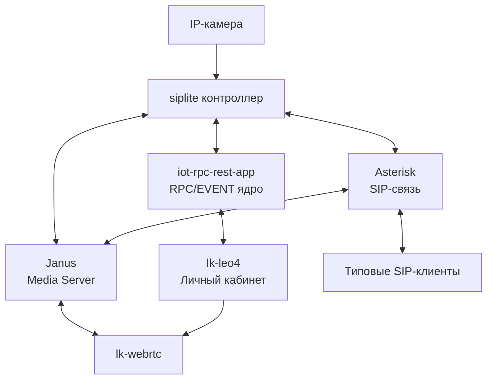
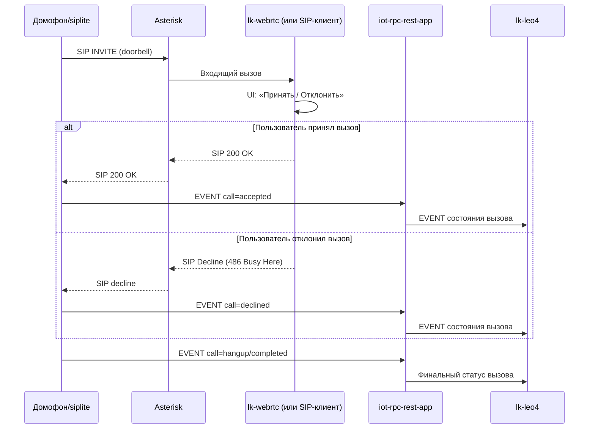
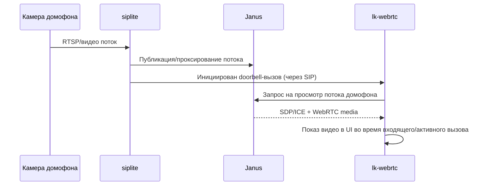
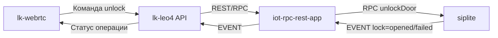
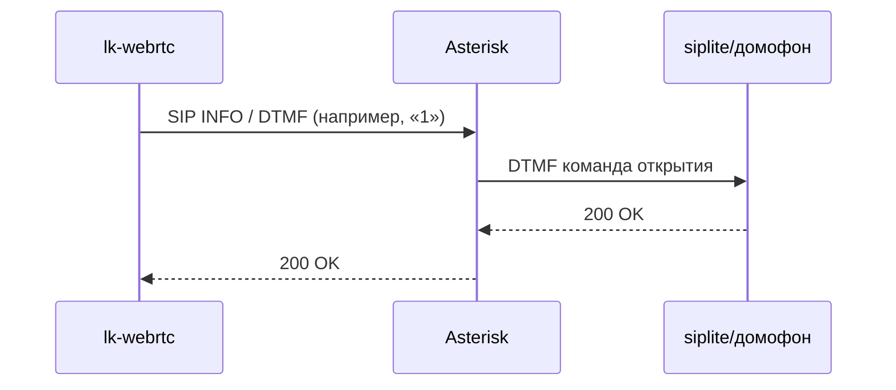

# Презентация решения: SIP/Video инфраструктура с lk-webrtc

## 1. Цель решения

Построить единую платформу голосовой и видеосвязи, где:
- контроллер **siplite** управляет SIP/видеотерминалами и подключенной IP-камерой;
- ядро **iot-rpc-rest-app** обеспечивает RPC/EVENT-взаимодействие контроллеров;
- личный кабинет **lk-leo4** предоставляет операторский и клиентский интерфейс;
- медиапотоки обрабатываются через **Janus**;
- SIP-сигнализация обслуживается **Asterisk**;
- абоненты используют типовые SIP-клиенты или **lk-webrtc**.

---

## 2. Компоненты системы

- **siplite**: контроллер на объекте, интеграция SIP и IP-камеры, управление замком.
- **iot-rpc-rest-app**: RPC/EVENT ядро оркестрации и интеграции контроллеров.
- **lk-leo4**: личный кабинет (администрирование, мониторинг, управление).
- **Janus WebRTC Gateway**: медиа-шлюз для WebRTC и видеостриминга.
- **Asterisk**: SIP-сервер, регистрация абонентов, маршрутизация вызовов.
- **lk-webrtc / SIP-клиенты**: конечные клиентские приложения абонентов.

---

## 3. Высокоуровневая архитектура

---

## 4. Doorbell-сценарий голосового вызова (входящий SIP от siplite)

### Состояния звонка в клиенте

- `incoming` — входящий doorbell-вызов от `siplite`;
- `accepted` — вызов принят пользователем;
- `declined` — вызов отклонен пользователем;
- `in_call` — активный разговор;
- `hangup` — вызов завершен.

---

## 5. Doorbell-сценарий видеостриминга (Janus/WebRTC)

Для `lk-webrtc` целевой UX: при входящем doorbell-вызове запускать просмотр дефолтного потока домофона, чтобы пользователь видел посетителя до ответа и во время разговора.

---

## 6. Управление замком (команда из клиента в siplite)

### 6.1 Управляющий контур

### 6.2 SIP-контур в активном звонке (типовой вариант для домофона)

В `lk-webrtc` это отражается кнопкой UI «Открыть», которая отправляет управляющую команду на `siplite` (например, DTMF в активной SIP-сессии), после чего UI показывает подтверждение/ошибку операции.

---

## 7. Роли и сценарии пользователей

- **Оператор/администратор (lk-leo4)**:
  - управление контроллерами и терминалами;
  - просмотр статусов и событий;
  - диагностика каналов связи.
- **Абонент**:
  - принимает входящий doorbell-вызов в `lk-webrtc`/SIP-клиенте;
  - отвечает или отклоняет вызов;
  - смотрит видеопоток с домофона;
  - открывает замок из UI.

---

## 8. Преимущества архитектуры

- Разделение сигнализации (**Asterisk**) и медиа (**Janus**).
- Поддержка E2E doorbell-сценария: вызов + видео + управление замком.
- Масштабируемость по контроллерам и клиентам.
- Поддержка гибридного клиентского контура (SIP-клиенты + WebRTC).
- Централизованное управление и мониторинг через RPC/EVENT ядро и ЛК.
- Переиспользование существующих интеграций (siplite, iot-rpc-rest-app, lk-leo4).

---

## 9. Репозитории компонентов

- siplite: <https://github.com/OlegLebedevRU/siplite>
- iot-rpc-rest-app: <https://github.com/OlegLebedevRU/iot-rpc-rest-app>
- lk-leo4: <https://github.com/OlegLebedevRU/lk-leo4>
- lk-webrtc: <https://github.com/OlegLebedevRU/lk-webrtc>
