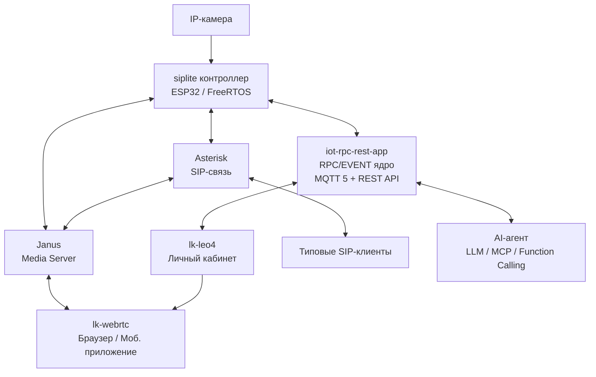
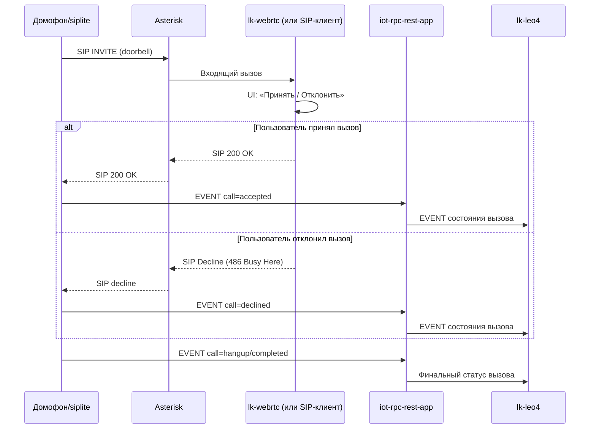
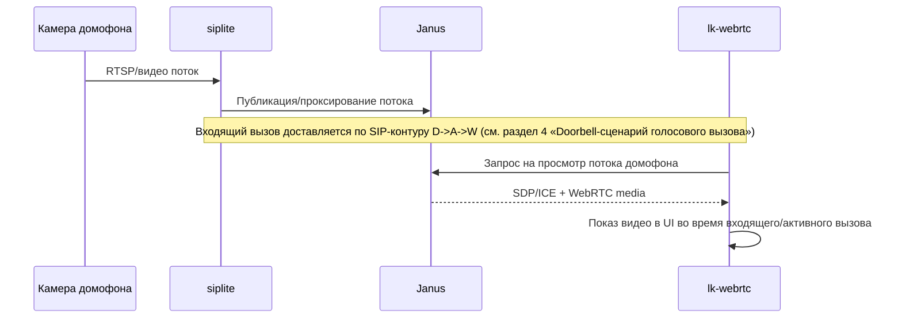
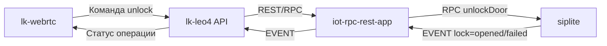
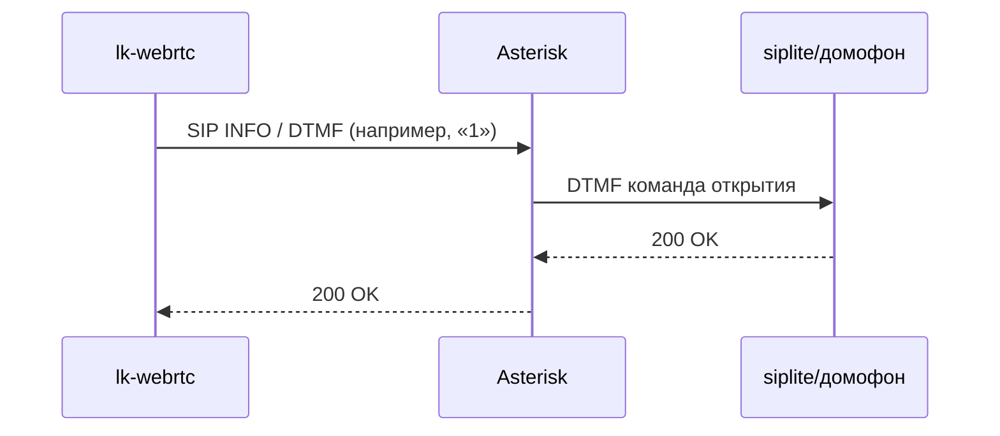
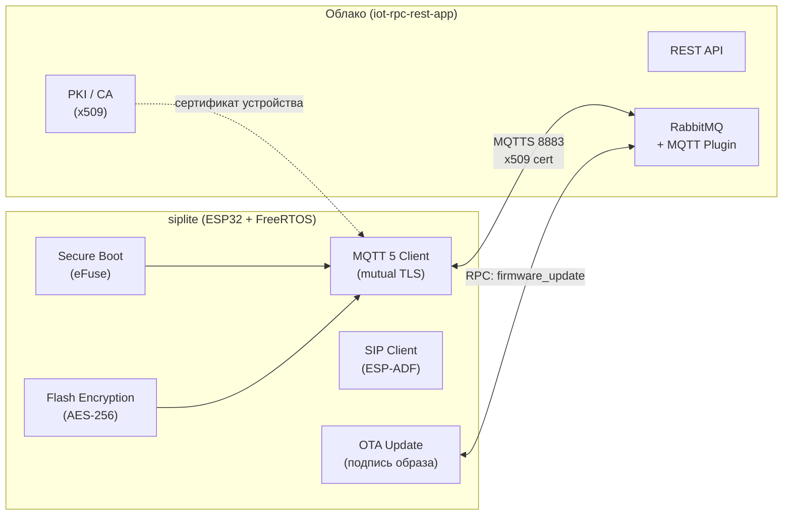
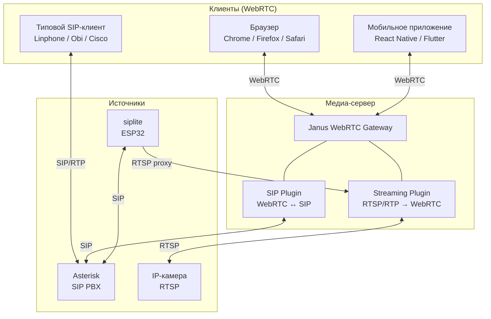
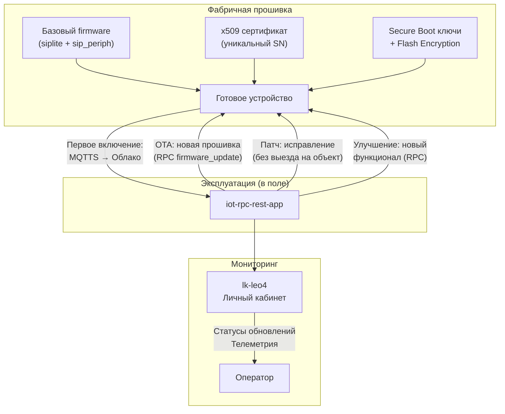
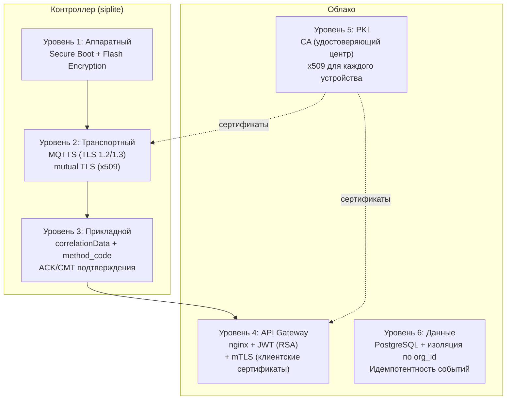
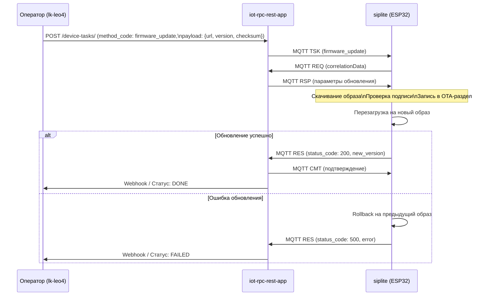

# Презентация решения: SIP/Video инфраструктура с lk-webrtc

> **Платформа:** LEO4 (dev.leo4.ru)
> **Контакты:** info@platerra.ru | https://platerra.ru

## 1. Цель решения

Построить единую платформу голосовой и видеосвязи, где:
- контроллер **siplite** управляет SIP/видеотерминалами и подключенной IP-камерой;
- ядро **iot-rpc-rest-app** обеспечивает RPC/EVENT-взаимодействие контроллеров;
- личный кабинет **lk-leo4** предоставляет операторский и клиентский интерфейс;
- медиапотоки обрабатываются через **Janus**;
- SIP-сигнализация обслуживается **Asterisk**;
- абоненты используют типовые SIP-клиенты или **lk-webrtc**.

---

## 2. Компоненты системы

### 2.1. siplite — легковесный контроллер на объекте

Контроллер на базе **ESP32 (ESP-ADF)**, работающий под управлением **FreeRTOS** (без Linux, buildroot и аналогичных тяжеловесных ОС). Обеспечивает:

- **SIP-клиент** — голосовая связь и домофония (SIP INVITE/BYE, RTP-потоки);
- **Интеграция с IP-камерой** — проксирование RTSP-потока в Janus для WebRTC-трансляции;
- **Управление периферией** — замки, датчики, NFC, дисплей (через модуль [sip_periph](https://github.com/OlegLebedevRU/sip_periph) на STM32F411);
- **Транспорт iot-rpc** — подключение к облаку через MQTT 5 (MQTTS, mutual TLS, x509-сертификаты), типизированный RPC с correlationData, события с подтверждением;
- **Аппаратные средства защиты** — доверенная загрузка (Secure Boot), защита памяти (Flash Encryption), хранение ключей в eFuse;
- **Удалённое обновление прошивок** — OTA (Over-The-Air) через RPC-команду с облака, с верификацией подписи образа;
- **Голосовой терминал AI-агента** — захват аудио с микрофона и воспроизведение через динамик, интеграция с STT/TTS/LLM через SIP/RTP-канал.

### 2.2. iot-rpc-rest-app — облачное RPC/EVENT ядро

Транспортный фреймворк ([iot-rpc-rest-app](https://github.com/OlegLebedevRU/iot-rpc-rest-app)) на базе **FastAPI + FastStream + RabbitMQ + PostgreSQL**:

- **Асинхронный RPC** — очередь задач с приоритетами и TTL, двойная стратегия доставки (Push-триггер + Pull-поллинг);
- **Событийная модель** — асинхронные события от устройств (evt/eva) с идемпотентной обработкой и Webhook-уведомлениями;
- **Безопасность** — mutual TLS (nginx + x509), JWT (RSA), API-ключи, собственный PKI (CA);
- **Типизированный протокол** — MQTT v5 User Properties (method_code, status_code, correlationData), JSON-payload с числовыми тегами;
- **Сквозная корреляция** — UUID проходит через все этапы RPC (TSK → REQ → RSP → RES → CMT);
- **REST API + Swagger** — полный CRUD для задач, событий, устройств; совместим с AI-агентами (Function Calling, MCP);
- **Контейнеризация** — Docker Compose (nginx, app, RabbitMQ, PostgreSQL, certbot, avahi).

### 2.3. lk-leo4 — личный кабинет

Веб-приложение ([lk-leo4](https://github.com/OlegLebedevRU/lk-leo4)) на **React + TypeScript + Vite**:

- Администрирование устройств и контроллеров;
- Создание и мониторинг задач для устройств;
- Просмотр истории событий и телеметрии;
- Операторский интерфейс диагностики каналов связи.

### 2.4. Janus WebRTC Gateway — медиа-шлюз

- **SIP Plugin** — WebRTC↔SIP мост для голосовых/видео вызовов;
- **Streaming Plugin** — трансляция RTSP/RTP-потоков IP-камер в WebRTC;
- **Simulcast и SVC** — адаптивное качество видео;
- **ICE/STUN/TURN** — NAT traversal для P2P-соединений.

### 2.5. Asterisk — SIP-сервер

- Регистрация SIP-абонентов, маршрутизация вызовов;
- DTMF-команды для управления замками в активном звонке;
- Интеграция с Janus для WebRTC↔SIP bridging.

### 2.6. lk-webrtc — клиентское WebRTC-приложение

Модульное приложение ([lk-webrtc](https://github.com/OlegLebedevRU/lk-webrtc)) на **TypeScript + Vite**:

- **SipPlugin** — регистрация, входящие/исходящие звонки, DTMF, SIP MESSAGE, трансфер;
- **StreamingPlugin** — просмотр видеопотоков, список стримов, переключение, пауза, simulcast;
- **JanusClient** — платформо-независимая обёртка над Janus (без зависимости от DOM/jQuery);
- **Переносимость** — модули `JanusClient`, `SipPlugin`, `StreamingPlugin` могут быть переиспользованы в мобильном приложении (React Native) без изменений;
- **Совместимость** — работает в любом современном браузере (Chrome, Firefox, Safari, Edge) и на мобильных устройствах.

---

## 3. Высокоуровневая архитектура

---

## 4. Doorbell-сценарий голосового вызова (входящий SIP от siplite)

### Состояния звонка в клиенте

- `incoming` — входящий doorbell-вызов от `siplite`;
- `accepted` — вызов принят пользователем;
- `declined` — вызов отклонен пользователем;
- `in_call` — активный разговор;
- `hangup` — вызов завершен.

---

## 5. Doorbell-сценарий видеостриминга (Janus/WebRTC)

Для `lk-webrtc` целевой UX: при входящем doorbell вызове запускать просмотр потока домофона по умолчанию, чтобы пользователь видел посетителя до ответа и во время разговора.
Перед автозапуском потока рекомендуется проверять авторизацию пользователя и учитывать настройки приватности (например, запрет автопоказа видео без явного действия пользователя).

---

## 6. Управление замком (команда из клиента в siplite)

### 6.1 Управляющий контур

### 6.2 SIP-контур в активном звонке (типовой вариант для домофона)

В `lk-webrtc` это отражается кнопкой UI «Открыть», которая отправляет управляющую команду на `siplite` (например, DTMF в активной SIP-сессии), после чего UI показывает подтверждение/ошибку операции.

Рекомендуемая модель: `6.1` как основной enterprise-контур (аудит, ACL, журналирование), `6.2` как совместимый SIP-механизм для домофонов, где открытие замка реализовано через DTMF-команду в активном вызове.

---

## 7. Роли и сценарии пользователей

- **Оператор/администратор (lk-leo4)**:
  - управление контроллерами и терминалами;
  - просмотр статусов и событий;
  - диагностика каналов связи.
- **Абонент**:
  - принимает входящий doorbell вызов в `lk-webrtc`/SIP-клиенте;
  - отвечает или отклоняет вызов;
  - смотрит видеопоток с домофона;
  - открывает замок из UI.

---

## 8. Преимущества архитектуры

### 8.1. Легковесное ПО контроллеров siplite на RTOS

| Характеристика | Описание |
|----------------|----------|
| **RTOS вместо Linux** | Контроллер siplite работает под FreeRTOS на ESP32 — без Linux, buildroot, тяжёлых дистрибутивов. Это обеспечивает минимальное время загрузки (< 1 с), детерминированное поведение и минимальный footprint (< 4 МБ flash, < 520 КБ SRAM) |
| **Доверенная загрузка** | Аппаратный Secure Boot (ESP32 eFuse) — загружается только подписанный образ прошивки. Невозможно выполнить неавторизованный код на контроллере |
| **Защита памяти** | Flash Encryption — содержимое flash-памяти зашифровано аппаратно. Даже при физическом доступе к микроконтроллеру невозможно считать прошивку или данные |
| **Защищённый типизированный RPC** | Управление контроллером через iot-rpc (MQTT 5 + TLS + x509): строго типизированные команды с `method_code`, `correlationData`, `status_code`. Каждый этап RPC подтверждается (ACK/CMT), обеспечивая гарантированную доставку |
| **Удалённое обновление прошивок (OTA)** | Прошивка обновляется удалённо через RPC-команду с облака. Образ подписан, верифицируется перед установкой. Поддержка rollback при сбое обновления. Позволяет массово обновлять тысячи контроллеров в поле |
| **Минимальная поверхность атаки** | Нет ОС общего назначения — отсутствуют shell, пакетный менеджер, сетевые сервисы Linux. Только целевой код приложения на bare-metal RTOS |

### 8.2. Технология WebRTC — интеграция с современными платформами

| Возможность | Описание |
|-------------|----------|
| **Браузерная совместимость** | WebRTC поддерживается нативно во всех современных браузерах (Chrome, Firefox, Safari, Edge) без установки плагинов или дополнительного ПО |
| **Мобильные приложения** | Модули `JanusClient`, `SipPlugin`, `StreamingPlugin` написаны без зависимости от DOM и могут быть переиспользованы в React Native / Flutter через `react-native-webrtc` |
| **Открытый стандарт** | WebRTC (RFC 8825-8835) — открытый стандарт IETF/W3C, в отличие от проприетарных протоколов видеотерминалов (H.323, ISDN, закрытые SDK). Отсутствие vendor lock-in |
| **Janus как медиа-шлюз** | Janus WebRTC Gateway — open-source (GPL-3), обеспечивает мост WebRTC↔SIP, WebRTC↔RTSP/RTP. Один шлюз для всех типов клиентов |
| **Адаптивное качество** | Поддержка Simulcast и SVC (Scalable Video Coding) — автоматическая адаптация качества видео к пропускной способности канала |
| **NAT traversal** | ICE/STUN/TURN — автоматический обход NAT, работает за файрволами и корпоративными прокси |
| **Не только видеотерминалы** | Вместо привязки к дорогостоящим проприетарным видеотерминалам, любой смартфон или ПК с браузером становится полноценным клиентом видеосвязи и домофонии |

### 8.3. Прозрачная схема массового производства и эксплуатации

| Аспект | Описание |
|--------|----------|
| **Доступная компонентная база** | ESP32 (Espressif) — массово выпускаемый чип с ценой от ~$2. STM32F411 — доступный периферийный микроконтроллер. Все компоненты имеют множество поставщиков и не подвержены единой точке отказа в цепи поставок |
| **Проработанная стратегия прошивки** | Прошивка разделена на два модуля: siplite (ESP32, SIP/MQTT/OTA) и sip_periph (STM32, замки/датчики/NFC/дисплей). Каждый модуль обновляется независимо. Фабричная прошивка включает: Secure Boot, Flash Encryption, x509-сертификат устройства, базовый firmware |
| **Массовое OTA-обновление** | Удалённое обновление прошивок через iot-rpc позволяет одной командой обновить тысячи контроллеров в поле. Поддержка приоритетов, TTL и rollback снижает риск массового bricking |
| **Низкобюджетное исправление ошибок** | Обнаруженные ошибки в ПО исправляются удалённо (OTA) без выезда на объект, без замены оборудования. Стоимость патча — только разработка + тестирование, доставка обновления бесплатна |
| **Улучшения на этапе эксплуатации** | Новый функционал (новые типы RPC-команд, новые сценарии автоматизации, интеграция с AI) доставляется на уже установленные контроллеры через OTA без вмешательства пользователя |
| **Open-source серверный стек** | Janus, Asterisk, RabbitMQ, PostgreSQL, nginx — всё open-source, без лицензионных отчислений. Docker Compose — единая команда для развёртывания серверной инфраструктуры |
| **Стандартная PKI** | x509-сертификаты (OpenSSL, pyca/cryptography) — стандартная инфраструктура открытых ключей. Масштабируется от единиц до сотен тысяч устройств |

### 8.4. Общие архитектурные преимущества

- **Разделение сигнализации и медиа** — Asterisk (SIP) и Janus (WebRTC/RTP) работают независимо, каждый компонент масштабируется отдельно;
- **Поддержка E2E doorbell-сценария** — полный цикл: вызов + видео + управление замком из единого клиентского приложения;
- **Масштабируемость** — архитектура поддерживает от единиц до тысяч контроллеров и клиентов;
- **Гибридный клиентский контур** — одновременная работа SIP-клиентов и WebRTC-клиентов через единый медиа-шлюз;
- **Централизованное управление** — все контроллеры управляются через единое RPC/EVENT ядро и личный кабинет;
- **Интеграция с AI** — REST API + Webhooks позволяют AI-агентам (LLM, MCP, Function Calling) управлять физическими устройствами;
- **Переиспользование компонентов** — модульная архитектура: siplite, iot-rpc-rest-app, lk-leo4, lk-webrtc — каждый компонент разрабатывается и обновляется независимо.

---

## 9. Безопасность — многоуровневая модель

| Уровень | Компонент | Механизм защиты |
|---------|-----------|----------------|
| Аппаратный | ESP32 (siplite) | Secure Boot (eFuse), Flash Encryption (AES-256) |
| Транспортный | MQTT 5 | Mutual TLS, x509-сертификаты устройств |
| API Gateway | nginx | JWT (RSA) для веб-клиентов, mTLS для устройств |
| Прикладной | iot-rpc | correlationData (UUID), TTL, приоритеты, ACK/CMT |
| Данные | PostgreSQL | Изоляция по org_id, идемпотентная обработка событий |
| Клиенты | lk-webrtc | API-ключи (X-API-Key), HTTPS, WSS |

---

## 10. Сценарий удалённого обновления прошивок (OTA)

---

## 11. Репозитории компонентов

| Компонент | Репозиторий | Назначение |
|-----------|------------|------------|
| **Cloud Core (Backend)** | [iot-rpc-rest-app](https://github.com/OlegLebedevRU/iot-rpc-rest-app) | REST API, RPC-ядро, MQTT-брокер, БД, Webhooks |
| **Личный кабинет** | [lk-leo4](https://github.com/OlegLebedevRU/lk-leo4) | Веб-интерфейс управления (React + TypeScript) |
| **Периферийный модуль** | [sip_periph](https://github.com/OlegLebedevRU/sip_periph) | Прошивка STM32F411 — замки, датчики, NFC, дисплей |
| **SIP-контроллер** | [siplite](https://github.com/OlegLebedevRU/siplite) | ESP32 (FreeRTOS): SIP, MQTT, OTA, домофония |
| **WebRTC-клиент** | [lk-webrtc](https://github.com/OlegLebedevRU/lk-webrtc) | Браузерное/мобильное приложение: SIP + Streaming |
